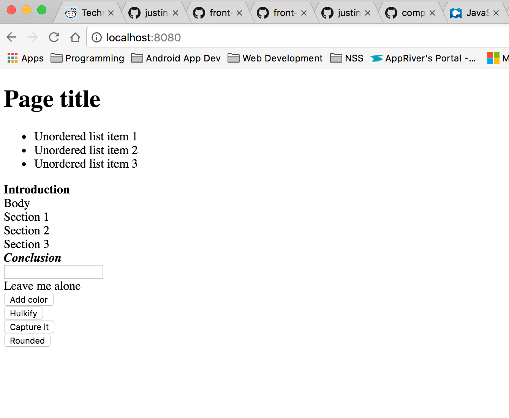
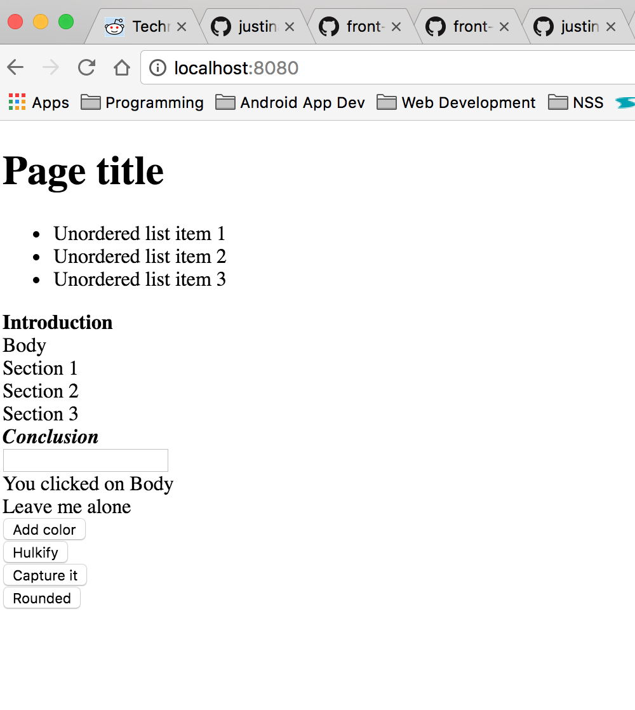
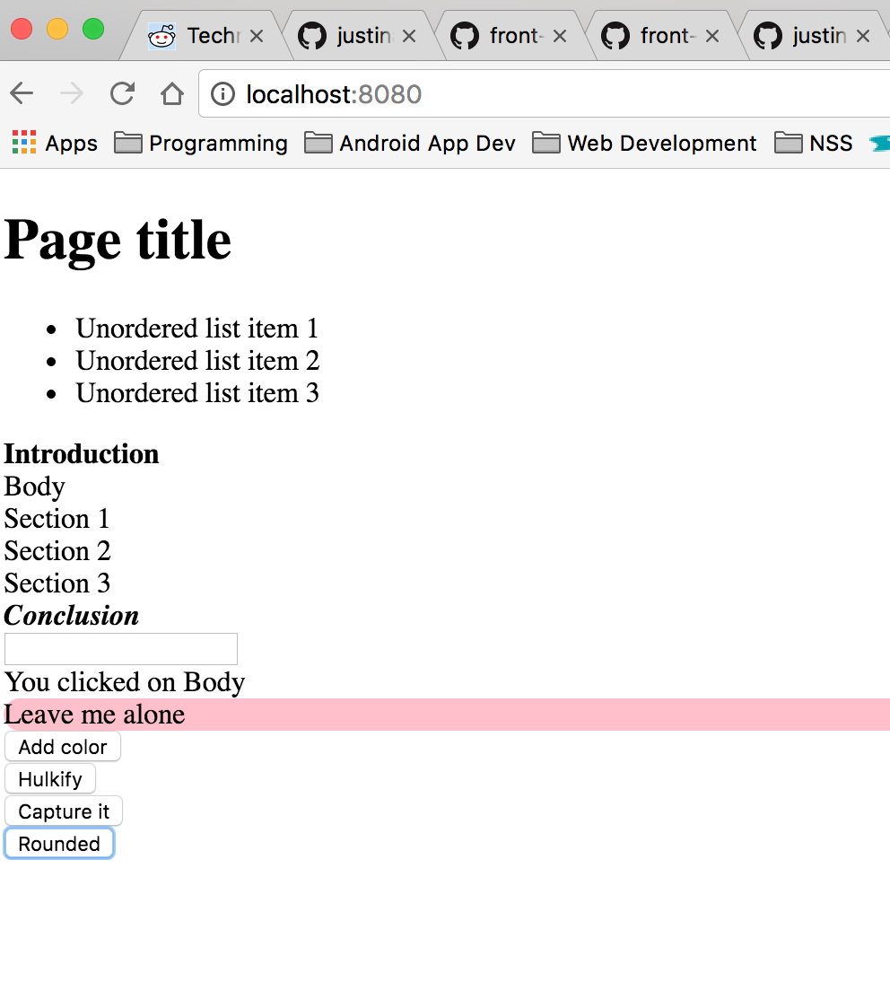

#Event-Handler


## Description
This is an introduction to event handlers and what you can do with them. In this exercise I placed event handlers on all the section elements inside the article element. Depending on what you do they color some text, they display messages like "You left me!!".

## How to run
In your terminal run:
```
http-server -p 9999
```
then navigate to http://localhost:9999 in your browser.

## Screenshots




## Contributors
- [Justin Leggett](https://github.com/justinal64)